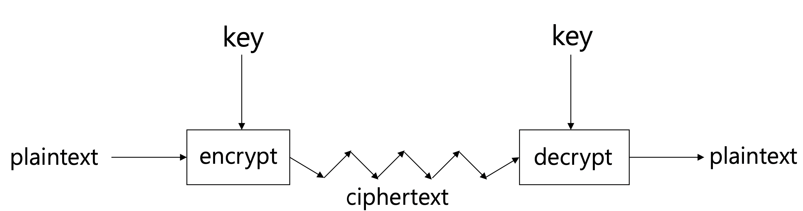

# 블록체인 중간

날짜: 2022년 10월 18일 → 2022년 10월 24일
태그: 중간

T801,802 오후 6시 학과홈페이지에서 자리 확인할 것!!

→ T802 자리는 지정석??

# 비트코인이란? (문제와 해결을 중심으로)

- 비스코인 시스템의 원리
- 탈중앙화 시스템
- 여러가지 문제들의 해결 방법

## 비트코인의 원리

비트코인은 프로토콜의 집합이다. 즉 규칙이 정해져 있는 통신시스템이다.

- 비트코인은 transaction 이라는 거래명부(돈의 흐름을 기록)로 이뤄진다.
    - transaction 이란?
        - “A가 B에게 1BTC 보냈음” 의 정보가 담긴 것
- transaction 들을 여러 개 모아서 block 안에 기록한다.
- 이래서 이름이 `블록체인` 인거임

## 의문점과 문제점

- 명부(transaction) 는 누가 관리합니까?
    - 누구나 열람할 수 있도록
        - 즉, account 만 있다면 누구나 열여보고 확인할 수 있다.. 완전 naked…
        - 그러나 권리에 따른 책임은 없는 시스템!! : 언제든지 들어오고 나갈 수 있음

- 계정(account) 는 누가, 어떻게 생성합니까?
    - public key 로 계정 생성
        - 생성된 public key 가 사용자의 아이디 및 adress 가 된다.
        - public key 이므로 누구나 개인의 adress 에 접근할 수 있음
    - 계정의 비밀번호는 `디지털 서명` 으로 작동
        - `디지털 서명` 을 만들기 위해서는 private key가 필요
        - 즉, public key(adress) 의 짝이 되는 private key 가 계정 생성 시 부여됩니다~~
    - 계정 생성에는 횟수 제한이 없음

- 거래의 순서 :  A→B→C vs B→C→A 처럼 양립할 수 없는 거래의 순서는 매우 중요하다.
    - 송출의 기록(transaction)을 여러개로 묶어서 블록 안에 기록
        - 블록 단위로 기록되므로 거래의 순서는 곧 블록의 순서가 될 것임
        - 즉, 다음과 같은 과정을 통해 누군가의 소비가 인정된다.
            - A는 transaction : A→B 를 채굴자에게 요구
            - transaction 이 유효한지 검사 (유효하면,)
            - 채굴자는 transaction 을 블록 안에 넣어줌
            - 블럭이 채굴되면
            - 다른 채굴자들에게 유효한지 시험받음
            - 최종적으로 의견일치가(6블럭 정도) 되면 거래가 인정됨
        - 6블럭 정도 이후에 B는 ‘안전하게’ A가 요청한 transaction 을 통해 새로운 transaction 을 요구할 수 있음

# 블록체인 암호학

블록체인의 보안을 담당하는 여러가지 암호(crypto) 기법을 알아보고, 어떻게 목적을 달성하는 지 알아본다.

## 암호학의 4대 목표

- Confidentiality(기밀성) : 데이터가 유출되지 않았는가(나에게만 보이는가)?
- Data integrity(무결성) : 데이터가 훼손되지 않았는가
- Authentication(신빙성) : 데이터가 원본인가? 진짜를 흉내낸 가짜가 아닌가?
- Non-repudiation(부인방지) : 이미 일어난 사건에 대해 부인하는 것을 막을 수 있는가?

## 암호학 용어 및 가정

### 용어

- `cipher`, `cryptosystem` : `plaintext` 를 `encrypt` (암호화) 시키는데 사용되는 알고리즘
    - `plaintext` : 암호화의 대상. 수신자에게 유출되지 않고 전달되어야 하는 목표가 있음
    - `encrypt(plaintext,key)=ciphertext`
    - `ciphertext` : 암호화된 `plaintext`
- `ciphertext` 를 `decrypt` (복호화) 시켜 `plaintext` 추출해냄
    - `plaintext=decrypt(ciphertext,key)`
    - `private_key` : 수신자만이 가지고 있는 복호화의 열쇠(key)
- symmetric key system : `encrypt` 와 `decrypt` 하는데 유일한(하나의) 키가 사용되는 시스템
    
    
    
- asymmetric key system : `public_key` 로 `encrypt` , `decrypt` 시 `private_key` 사용됨

### 가정

- 모든 암호학 시스템은 공격자에게 알려져 있다.
    - 알려져도 상관없다는 말
    - 즉, 알려져도 안전한 시스템을 만드는 것이 목표

## `cipher` 기법

- random functions - `hash` functions
    - input : 길이의 제한이 없다 $0\sim \infty$ , output : 길이가 고정되어 있다
    - 입력의 길이엔 제한이 없으나 출력의 길이가 일정하므로 `충돌 crash` 이 발생할 수 있음
        - 충돌 : 서로 다른 input 에 대해서 output 이 똑같은 상황
- random generator - stream ciphers
    - input 의 길이가 짧고 output 의 길이가 길다
- random permutations - block ciphers
    - key 를 통해 input 을 output 으로 output 을 input 으로
    - input, output 모두 일정한 길이
- public key encryption
    - public key 를 통해 encryption 을 누구나 할 수 있음
    - 열어보는 것은 private key 소유자만 가능
- digital key signatures
    - private key 소유자만 사인 가능
    - 누구든지 public key 통해 사인의 유효성 검증 가능

## symmetric crypto

### hash collision issue :  해시함수에서의 충돌 문제


- collision resistance : 같은 해시값을 출력하는 두 개의 입력값을 찾기 어렵다.
- preimage resistance : 특정 해시값을 만족시키는 입력값을 찾기 어렵다(POW).
- second-preimage resistance : 특정 입력값에 해당하는 해시값을 동일하게 가지는 다른 입력값을 찾기 어렵다.

모두 다 같은 말처럼 보이지만 공격자의 목표에 따라 각각 다른 의미를 지닌다.

### cryptographic hash function 에서 요구되는 것

- 압축성 compression  : output(해시값)의 길이가 짧아야 한다.
- 효율성 efficiency : 입력값으로 해시값을 얻어내는 데 계산이 쉬워야(빨라야)한다. $hash(x)\text{ is fast and easy}$
- 단방향 one-way : 해시값을 얻는 입력값을 찾기 어려워야 한다. $\text{hard to find } x\text{ that                   } h(x)=y$
- 충돌안정성 collision resistance : 충돌이 일어나는 것을 완전히 막을 수 없으나, 충돌이 발생하는 입력을 찾는 게 매우매우매우 어려워야 한다.

### hash function 의 안정성

- **Birthday Paradox**
    
    n 명이 있을 때, 어느 두명이 생일을 공유할 확률
    
    $$
    _nC_2\cdot \left(\frac{1}{365}\right)^2\left(\frac{364}{365}\right)^{n-2} =\frac{1}{2}
    $$
    
    위 식에서 $(364/365)^{n-2} \to 1$ 로 하면 다음과 같이 간단하게 $n$ 을 구할 수 있다.
    
    $$
    \frac{n(n-1)}{2}\left(\frac{1}{365}\right)^2=\frac{1}{2}\;\;\;\;\; take\;\;
    \frac{n(n-1)}{2}\approx \frac{n^2}{2}\\
    \therefore n=\sqrt{365}
    $$
    
    여기서 중요한 것은 $\sqrt{\;\;\;}$ 임을 알아두자.
    

위의 birthday paradox를 통해 hash function 을 기반으로 하는 보안 시스템의 취약점을 계산할 수 있다.

먼저 주어진 시스템의 collision resistance 가 매우 높다 가정하고, output 의 길이가 $N\,bit$ 라 하자.

output 의 가능한 경우의 수는 $2^N$ 개일 것이다.

그렇다면 birthday paradox 의 birthday 에 해당하는 것이 $2^N$ 이므로, 최초 collision 이 일어날 수 있는 합리적인(확률=1/2) 횟수는 $\sqrt{2^N}=2^{\frac{N}{2}}$이 된다.

즉, $2^{\frac{N}{2}}$연산을 하면 hash function 을 깰(break) 수 있다.

### hash function 의 사용

사이트에 로그인 하는 상황을 생각해보자.


로그인하기 위해서는 아이디와 패스워드가 필요하다.

기본적으로 사이트의 DB 에는 $\text{[id,password]}$ 의 쌍이 저장되는 것을 기대할 수 있다.

그러나 사이트의 DB가 한번 털리면, 모든 사용자의 로그인 정보가 털리는 것이므로 안전하지 않다.

따라서 실제 사이트의 DB 안에는 password 를 input 으로 하는 해시값이 저장되어 있다.

즉, 로그인 시 사용자는 패스워드 입력을 통해 해시값을 생성하고, 생성된 해시값과 DB 의 해시값을 비교한다.

## asymmetric crypto

### RSA 알고리즘

ALICE 와 BOB 사이의 은닉 메시지 전달이 목적

연산 속도가 빠르지만 `key size` 가 알고리즘의 안정성을 결정한다는 점에서 길이가 충분히 길어야 하는데, 문제는 `key` 생성 방식이 소수를 찾는 과정이므로 시간이 꽤 오래 걸린다는 단점이 있다.

- `public key` `private key` 생성
    - $p-1, q-1$ 과 각각 서로수인 정수 $e$ 를 준비한다
    - $ed$ 를 $(p-1)(q-1)$ 로 나눈 나머지가 1이 되는 $d$ 를 찾는다.
    - $pq=N$ 인 $N$과 $e$ 를 공개한다. 여기서 $(N,e)$ 를 공개키(`public key`) 라고 한다.
    - 그러면 $d$ 는 비밀키(`private key`) 가 된다.

- `private key` 통한 `encryption` & `decryption` 과정
    - BOB → ALICE : BOB 은 ALICE 의 `public key` $(N,e)$ 를 통해 보내려는 메시지를 `encrypt`
        - `plaintext` 인 $a$ 를 $x=a^e\mathtt{\;\;mod\;\;} N$ 으로 `encrypt` 한다.
    - ALICE : BOB 이 보낸 $x$ 를 `private key` ($d$)를 통해  `decrypt`
        - $a'=x^d$  ⇒ $a'=a$ 이 성립하므로
        - ALICE 와 BOB 사이의 거래는 안전함이 보장된다

### Diffie-Hellman 알고리즘

ALICE 와 BOB 이 공유하는 `public key` `private key` 쌍을 안전하게 생성하는 것이 목적

- ALICE와 BOB이 공유하는 `public key` 로서 적당한 수 $p$ 와 $g$를 고른다.
    - $p=23,\;\;g=5$
- ALICE가 자신의 `private key` 로서 $a$ 를 선택하고 $A=g^a \text{ mod } p$  를 BOB 에게 보낸다. (`encrypt`)
    - $a=4,\;\;A=5^4\text{ mod }23=4 \to$ BOB
- BOB 또한 자신의 `private key` 로서 $b$ 를 선택하고 $B=g^b \text{ mod } p$  를 ALICE 에게 보낸다. (`encrypt`)
    - $b=3,\;\;A=5^3\text{ mod }23=10 \to$ ALICE
- ALICE 는 도착한 $B$ 를 `private key` $a$ 로 `decrypt` $s=B^a \text{ mod } p$ 한다.
    - $s = 104 \text{ mod } 23 = 18$
- BOB 는 도착한 $A$ 를 `private key` $b$ 로 `decrypt` $s=A^b \text{ mod } p$ 한다.
    - $s = 43 \text{ mod } 23 = 18$

ALICE 와 BOB 에게 $s$ 라는 동일한 수가 생성되므로 둘만이 알고 있는 `private key` 가 성공적으로 공유되었다.

### ECC 알고리즘

타원곡선의 수학적 성질을 사용한 알고리즘

- `RSA` 알고리즘에 비해 `key size` 가 작으므로 `key` 생성 시 적은 시간이  든다.
    - 같은 길이의 `key size` 비해 `RSA` 보다 보안이 우수하다.
- `private key` 를 이용하여 서명하는 시간이 `RSA` 보다 빠르다.
- `public key` 를 활용한 연산에는 속도가 느리다.
- 서명+검증(`sign` + `verification` ) 속도는 `RSA` 보다 빠르다.

따라서 서명+검증 절차에는 많이 쓰이고 그 외의 분야에는 속도적 한계 때문에 `RSA` 만큼 활발하게 사용하진 않는다.

### Non Non repudiation

이미 일어난 사건에 대하여 서로가 부정(조작)할 수 없도록 하는 것

- `symmetric key` 방식 : 서명 없음
    - ALICE 가 BOB 에게 주식을 삼
        - 해당 내용의 `plaintext` 를 `symmetric key` 를 이용하여 `cipher text` 로 변환
    - 주식의 가격이 하락
    - ALICE 는 BOB 에게 주식을 사지 않았다고 주장함(사건 부정)
    - BOB 은 ALICE 의 주장이 거짓임을 밝힐 수 있는가? ⇒ NO!!!!!
        - ALICE 와 BOB 은 서로 같은 `key` 를 공유(`symmetric key`) 하고 있으므로 제3가 봤을땐
        - BOB 이 거짓말한다고 볼 수도 있음(즉, ALICE 는 산 적이 없는데 BOB 이 조작했다)

- `asymmetric key` 방식 : 서명 사용
    - ALICE 가 BOB 에게 주식을 삼
        - 해당 내용의 `plaintext` 를 ALICE 의 `private key` 를 이용하여 `cipher text` 로 변환
    - 주식의 가격이 하락
    - ALICE 는 BOB 에게 주식을 사지 않았다고 주장함(사건 부정)
    - BOB 은 ALICE 의 주장이 거짓임을 밝힐 수 있는가? ⇒ YES!!!!
        - ALICE 의 `private key` 를 사용했기 때문에 BOB 은 사건의 조작이 불가능하다는 알리바이를 얻는다.
        - 즉, `asymmetric key` 는 ALICE 와 BOB 모두에게 유용하다.

## 디지털 서명

앞서 나온 암호화 기법을 통해 `digital signature` 이 동작하는 과정과 실효성에 대해 알아본다. 

### 사이트 인증서

사용자가 사이트에 접속하기 전에 사이트가 안전한지???

→ 해당 사이트가 위조 사이트가 아닌지? (`Authentication`)

를 검증하기 위해 사이트마다 보안 인증서 시스템이 존재한다. 사용자는 인증서를 통해 아래와 같은 사항이 유효한지 확인.

- CA(Certificate Authority) 가 유효한가?
    - 폐기되지 않은 인증서를 사용하는 게 맞는가? (유효기간 내에 드는가?)
    - 해당 사이트가 진짜를 흉내낸 가짜 사이트가 아닌가?
    
    $$
    \text{Cert}_C(A)=\{A,K_A,T,L\}_{{K_C}^{-1}}
    $$
    
    - $C$ 가 발급한 $A$ 의 인증서는 $C$ 의 `private key` $K_C^{-1}$ 를 이용하여
    - 발급한 시간 $T$ 부터 $L$ 기간 동안 $A$ 의 `public key` $K_A$를 보증한다.
    - 따라서 누구나 $K_A$ 를 가지고 있다면, 아래를 통해 $A$ 가 유효한지 검증할 수 있다.
        
        
        

### Hybrid envelope


- ALICE 는 `plaintext` 를 `enctrypt` 하기 위해 `common key` 를 생성한다.
    - $\text{ciphertext}=\text{encrypt(common\,key,plaintext)}$
- ALICE 는 BOB 의 `public key` 를 사용하여 `common key` 를 `encrypt` 한다.
    - $\text{encrypted(secret)\,key=encrypt(public\,key}_{BOB}\text{,common\,key)}$
- ALICE 는 `cipher text` 와 `encrypted key` 를 BOB에게 보낸다.
- BOB 은 자신의 `private key` 로 `encrypted key` 로부터 `common key` 를 얻어내고
- `common key` 로 `cipher text` 를 `decrypt` 하여 `plaintext` 를 얻어낸다.

### 전자서명의 동작원리


- 서명자의 비밀키를 통해 메시지를 암호화한 서명을 생성한다
- 메시지와 서명을 검증자에게 보내면,
- 서명자의 공개키를 통해 추출한 메시지와 함께 보내진 메시지를 비교하여 검증한다.


- 서명자와 검증자가 공유하는 데이터를 통해
- 서명자는 데이터의 해시값을 본인의 비밀키로 암호화한 서명과 인증서를 함께 검증자에게 보낸다.
- 검증자는 공유하는 데이터의 해시값과 서명자의 공개키로 서명을 복호화한 해시값의 비교를 통해
- 서명자의 인증서가 유효한지 검증할 수 있다.

# 블록체인의 동작 : 자료구조와 script

블록체인 시스템의 자료구조와 동작원리를 살펴보고, 거래가 이루어지는 script 를 뜯어본다.

## 블록체인의 자료구조와 유효성 검증

블록체인의 자료구조를 살펴보고, 해당 방식의 이점을 알아본다.

### Hash Pointer (linked list)


위의 그림과 같이 해시함수와 포인터가 연결된 해시 포인터 자료구조를 선탣하면, 외부의 공격을 빠르게 알아차릴 수 있다. 

블록의 상단에는 이전 블록의 전체 데이터에 대한 해시값과 이전 블록과 연결해주는 포인터가 있다.

즉, 연결된 포인터를 통해 이전 블록의 전체 데이터를 읽어들일 수 있고, 또한 해시함수를 적용해 나온 해시값과 저장된 해시값 비교를 통해 유효성 검증이 가능하다.


공격자의 입장에서 살펴보자.

공격자는 블록1 을 수정하기 위해

- 블록1 의 데이터를 수정하고
- 블록1 에 대한 해시값이 바뀔것이니, 블록2 의 데이터도 바꿔야 될 것이다
- 블록2 에 대한 해시값이 바뀔것이니, 블록3 의 데이터도 바꿔야 될 것이다
- $\cdots$

이렇게 맨 마지막 블록에 다다를 때까지 모든 블록의 데이터를 수정해야 하므로, 공격자는 특정 블록안의 내용을 바꾸기 어렵다.

또한 수정을 시도하면, 다른 사람들이 빠르게 알아차려 이에 대응할 것이므로 또한 어렵다.

### Merkle Tree


`merkle tree` 의 구조는 최상단 `transaction` 의 해시값으로서 `merkle root` 가 있고, 그것의 가지들을 이루는 leaves 로서 transaction들이 존재한다.

즉, `merkle root`  값만을 확인하면 어떤 `transaction` 이 조작되더라도 루트의 해시값이 변경되기 때문에 해당 블록이 유효한지 쉽고 빠르게 검증할 수 있다. 

각각 vs 블록 단위 `consensus` 효율을 생각해보면 확실히 블록단위로 관리하는 것이 더 효율적이다.

 특정 노드에 접근(예를 들면 거래(5) : 오른쪽 그림)할 때에도 $\log$ 높이 만큼의 적은 시간이 걸린다는 장점이 있다. 

따라서, 블록체인의 구조는 블록 각각은 블록-블록, 블록 내부에서는 TXN-TXN 구조를 따른다. 아래의 그림에서 통합된 구조를 확인할 수 있다.


## 검증 절차와 주소 생성

### 검증절차 (pseudo code)

- $\mathtt{(sk, pk) := generateKeys( keysize )}$
    - `keysize` 를 입력받아 공유키, 개인키 쌍을 발급한다.
    - `sk` : 사용자의 비밀키로서 메시지(`transaction` )에 서명할 때 이용된다.
    - `pk` : 사용자의 공유키로서 사용자가 맞는지 검증할 때 이용된다.
- $\mathtt{sig := sign( sk , message )}$
    - `sig` : 비밀키를 사용하여 메시지를 `encrypt`
- $\mathtt{isValid := verify( pk , message , sig )}$
    - 공유키를 통해 서명을 `decrypt` 한 결과와 메시지를 비교하여 검증
    - $\mathtt{						verify ( pk , message , sign ( sk , message )) == true}$ 인지 확인

### 비트코인 주소생성


- 비밀키를 보유
    - `18E14A7B6A307F426A94F8114701E7C8E774E7F9A47E2C2035DB29A206321725`
- 개인키에 부합하는 공유키를 생성
    - `0450863AD64A87AE8A2FE83C1AF1A8403CB53F53E486D8511DAD8A04887E5B23522CD470243453A299FA9E77237716103ABC11A1DF38855ED6F2EE187E9C582BA6`
- 공유키에 SHA-256 적용해서 해시값 생성
    - $\mathtt{SHA\text{-}256(pk)}$
    - `600FFE422B4E00731A59557A5CCA46CC183944191006324A447BDB2D98D4B408`
- 생성된 해시에 RUPEMD-160 적용해서 또 해시값 생성
    - $\mathtt{RUPEMD\text{-}160(\mathtt{SHA\text{-}256(pk))}}$
    - `010966776006953D5567439E5E39F86A0D273BEE`
- 생성된 해시의 맨 앞에 버전을 기록
    - $\mathtt{RUPEMD\text{-}160(\mathtt{SHA\text{-}256(pk)).version()}}$
    - `00010966776006953D5567439E5E39F86A0D273BEE`
- 버전기록된 해시에 SHA-256 적용해서 또또 해시값 생성
    - $\mathtt{SHA\text{-}256(RUPEMD\text{-}160(\mathtt{SHA\text{-}256(pk))}.version()))}$
    - `445C7A8007A93D8733188288BB320A8FE2DEBD2AE1B47F0F50BC10BAE845C094`
- 생성된 해시에 SHA-256 적용해서 또또또 해시값 생성
    - $\mathtt{SHA\text{-}256(SHA\text{-}256(RUPEMD\text{-}160(\mathtt{SHA\text{-}256(pk))}.version())))}$
    - `D61967F63C7DD183914A4AE452C9F6AD5D462CE3D277798075B107615C1A8A30`
- 생성된 해시의 4bytes 앞부분을 잘라내서 `checksum`
    - $\mathtt{checksum=SHA\text{-}256(SHA\text{-}256(RUPEMD\text{-}160(\mathtt{SHA\text{-}256(pk))}.version())))[:4bytes]}$
    - `D61967F6`
- 해당 `checksum` 을 5번의 해시에 붙이면 25bytes 이진 주소가 만들어진다
    - $\mathtt{adress=checksum}+\mathtt{RUPEMD\text{-}160(\mathtt{SHA\text{-}256(pk)).version()}}$
    - `00010966776006953D5567439E5E39F86A0D273BEED61967F6`
- 생성된 이진주소에 `base58` 인코딩을 적용하면 최종 주소가 생성된다
    - $\mathtt{adress}=\mathtt{base58(adress)}$
    - `16UwLL9Risc3QfPqBUvKofHmBQ7wMtjvM`

## transaction 원리와 script

### 화폐와 구분되는 비트코인의 개념


그림을 보면 비트코인이 지출되는 방식이 기존의 화폐와 많이 다르다는 것을 확인할 수 있다.

비트코인은 실체가 없다. 사용할 때마다 이전 지출 기록을 확인하여 재할당될 뿐이다. 그러므로 1회 소비시 비트코인을 “모두” 써버리는 것처럼 보인다.

즉, 비트코인에서는 “잔액”이라는 개념이 존재하지 않는다.


### transaction 구조


- metadata : transaction 의 ID(identity) 를 저장해두는 곳.
- inputs : 이전 transaction 을 참조하는 부분. 정확히는 이전 transaction 의 해시값과 포인터로 연결되어 있다. 이전 기록에서 claim 된 인덱스도 함께 저장되어 있다.
- outputs : 두 개의 필드 ( output 값들의 합 $\leq$ input 값들의 합 ) 로 검증하는 부분과 redeem 하기 위해 소유자의 signature 부분이 있다.

### transaction script

```solidity
<sig> 
<pubKey>
-------------- 
OP_DUP 
OP_HASH160 
<pubKeyHash?> 
OP_EQUALVERIFY 
OP_CHECKSIG
```


`-------------` 하단의 명령어(함수: `OP` 혹은 값: `< >`)를 푸시하고 스택의 최상단 값이 함수의 입력이 된다.

- 송금자의 개인키 서명(<sig>)을 스택에 푸시
- 송금자의 공개키(<pubKey>)를 스택에 푸시
- OP_DUP을 푸시하여 <pubKey>는 입력이 되어 최상단에 <pubKey> 복제 생성
- OP_HASH160푸시, <pubKey>가 입력, 출력은 <pubKeyHash>
- 송금자의 공개키해시로 <pubKeyHash?> 푸시
- OP_EQUALVERIFY 푸시, <pubKeyHash?>,<pubKeyHash> 가 입력으로 들어오고, 서로 일치하면 true, 아니면 false 출력. true이면 진행 false이면 강제종료.
- OP_CHECKSIG 푸시, <pubKey>,<sig> 가 입력, 서명과 일치하면 true 아니면 false


매우 복잡해보이지만.. 블록은 연속적으로 연결되어 있고, 앞서 말했듯 비트코인은 ‘잔액의 개념이 없다’ 의 연장선 상에서 unlocking, locking script가 연속되는 것이다. 위의 BOB→CHARLIE 의 예시를 보자.

- BOB 이 CHARLIE 에게 1BTC 를 보낸다는 메시지를 BOB 의 `sk` 로 BOB 의 `<sig>` 를 생성한다.
    - 즉,  `<<DEF>>`  의 OUTPUT
- 따라서 `<<DEF>>` 의 INPUT 에서는 과연 해당 `<sig>` 가 유효한지 검증하는 script 의 시험을 받게 되는 데 script 의 내용은 다음과 같다.
    - 이전 TXN 의 검증에서 통과해야만 `<<DEF>>` 가 유효할 것이므로 아래와 같은 검증을 받는다
        
        
        
        - 여기서 `<sig>` 는 바로 위에서 언급한 것, <public key>,<public hash> 모두 BOB의 것이다.
        - 즉 해당 script 는 ALICE→BOB 에서 BOB 의 claim 을 검증한다.
- 위의 과정이 검증되면 output 으로 아래를 내놓는다
    
    
    

아래 그림을 통해 위의 이해한 바를 한 번 더 확인하자.


이해한 바에 따르면, 오른쪽의 과정은 Sandra 가 누군가에게 비트코인을 보낼때의 TXN 에서 일어난다.